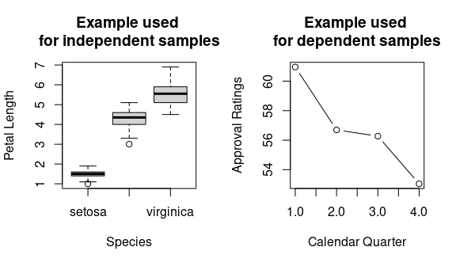

contrastanalysis
================
Mirka Henninger & Simone Malejka
2021-05-11

<!-- README.md is generated from README.Rmd. Please edit that file -->

This R-packages allows to perform contrast analyses for independent and
dependent samples. In addition to standard contrast analyses, methods
are provided to test two competing hypotheses can be tested against each
other. All functions and explanations are based on Rosenthal, Rosnow,
and Rubin(2000) as well as Sedlmeier and Renkewitz (2008).

Contrast analyses are a sensible alternative to standard variance
analyses as it allows to test specific, directed, a priori hypotheses.
This leads to results that are easier to interpret and effects can be
detected with a higher power.

#### The package can be installed using the <devtools>-package:

``` r
install.packages("devtools")
devtools::install_github("mirka-henninger/contrastanalysis")
```

## Getting started

### Introduction

**contrastanalysis** allows to perform contrast analyses for independent
and dependent samples. In addition to standard contrast analyses,
methods are provided to test two competing hypotheses can be tested
against each other. All functions and explanations are based on
Rosenthal, Rosnow, and Rubin(2000) as well as Sedlmeier and Renkewitz
(2008).

Contrast analyses are a sensible alternative to standard variance
analyses as it allows to test specific, directed, a priori hypotheses.
This leads to results that are easier to interpret and effects can be
detected with a higher power.

### The first steps

After the contrastanalysis package has been installed, we load it by the
following command.

``` r
library(contrastanalysis)
```

To illustrate the functions of this package, we use two datasets that
are already available in R: a subset of variables of the **iris** data
for contrast analysis for independent samples and **president** for
contrast analyses for dependent samples. We load the data using the
following code:

``` r
# load data
data("iris")
iris <- iris[,c("Species", "Petal.Length")]
presidents <- data.frame(Qtr1=presidents[seq(1, length(presidents), 4)],
                         Qtr2=presidents[seq(2, length(presidents), 4)],
                         Qtr3=presidents[seq(3, length(presidents), 4)],
                         Qtr4=presidents[seq(4, length(presidents), 4)])
presidents <- na.omit(presidents)
# some overview of the data
par(mfrow = c(1,2))
plot(iris$Species, iris$Petal.Length, type = "b", main = "Example used \nfor independent samples", xlab = "Species", ylab = "Petal Length")
plot(colMeans(presidents), type = "b", main = "Example used \nfor dependent samples", xlab = "Calendar Quarter", ylab = "Approval Ratings")
```

<!-- -->

The **iris** dataset contains the independent variable **Species** with
three groups (setosa, versicolor, and virginica) and the dependent
variable **Petal.Length**. The **presidents** datasets contains
quarterly approval rating for the US presidents.

We show how to test a priori specified hypotheses using planned contrast
analysis, but also how to directly test two competing contrasts against
each other. We will give an example of each approach for independent
samples using the **iris** dataset and for dependent samples using the
**presidents** dataset.

### Contrast analysis for independent samples

We would like to compare petal length of different species of iris. We
have two hypotheses:

H1: An increase in petal length from setosa over versicolor to virginica

H2: Setosa has smaller petal length than versicolor and virginica

For p = 3 groups of species, we can perform p - 1 = 2 planned contrasts.
The contrast weights of the two contrasts are based on the two
hypotheses:

λ(H1) = (-1,0,1)

λ(H2) = (-2,1,1)

Using these specification we can perform a contrast analysis for
independent samples using the package.

#### Testing planned contrasts

The contrast weights λ are assigned to an object using the matrix
function in R with contrasts in rows and groups in columns. The data
must contain subjects in rows and two columns: the first columns
contains the group indicator (here **Species**), the second column
contains the dependent variable (here **Petal.Length**).

``` r
# extract the number of groups
(nGroup <- length(levels(iris$Species)))
#> [1] 3

# define lambda weights
(lambda <- matrix(c(
  -1,0,1, # H1: An increase from setosa over versicolor to virginica
  -2,1,1), # H2: Setosa has smaller petal length than versicolor and virginica
  ncol = nGroup,
  byrow=TRUE))
#>      [,1] [,2] [,3]
#> [1,]   -1    0    1
#> [2,]   -2    1    1

# perform contrast analysis
contrast_independent(nGroup, lambda, iris)
#>            SumsofSquares        F estimate       t p rEffectSize rAlerting
#> Contrast 1      418.2025 2258.262    4.090 47.5212 0      0.9490    0.9781
#> Contrast 2      395.3712 2134.975    6.888 46.2058 0      0.9228    0.9511
#>            r2Alerting rContrast
#> Contrast 1     0.9568    0.9690
#> Contrast 2     0.9045    0.9673
```

The output of the **contrast\_independent** function contains results
for both contrasts: Sums of squares and corresponding F-values, contrast
estimates and corresponding *t*-values as well as two-tailed *p*-values.
Furthermore, it contains several effect sizes, such as r\_{} which can
be interpreted as a correlation between the dependent variable and the
contrast weights, *r*(alerting) corresponding to the correlation between
group means and contrast weights, *r*(alerting)² which can be
interpreted similar to a determination coefficient as a measured of
explained variance by the contrast. *r*(contrast) is useful for power
analyses.

The results of this empirical example show that for α = .05, Contrast 1
and Contrast 2 fit the data well, as all *t* \> 46.21 and all *p* \<
.001. Hence, it seems that there is an increase in petal length from
setosa over versicolor to virginica, and at the same time the results
suggest that setosa has smaller petal length than versicolor and
virginica.

#### Testing competing contrasts against each other

However, one may not be interested in whether there is support for H1
and/or H2 in the data, but in *which* of the two hypotheses H1 and H2
outperforms the other. We can directly test the two competing hypotheses
against each other:

``` r
# define lambda weights
lambda1 <- c(-1, 0, 1)  # H1: Iris versicolor is distinct to Iris setosa and Iris virginica
lambda2 <- c(-2, 1, 1)  # H2: Iris versicolor is more similar to Iris virginica

# Perform contrast analysis
compare_independent(nGroup=3, lambda1, lambda2, iris)
#> $results
#>            SumsofSquares      F estimate      t      p rEffectSize rAlerting
#> Contrast 1        1.1958 6.4574   0.1387 2.5411 0.0142      0.0507    0.0523
#>            r2Alerting rContrast
#> Contrast 1     0.0027    0.2051
#> 
#> $contrastWeights
#>   lambda1Std lambda2Std lambdaDiff
#> 1  -1.224745 -1.4142136  0.1894687
#> 2   0.000000  0.7071068 -0.7071068
#> 3   1.224745  0.7071068  0.5176381
```

The output of the **compare\_independent** function contains the same
information as **contrast\_independent** in terms of test statistics and
effect sizes. But, results are shown for one test only, namely a
different comparison of the two hypotheses. In addition, the
standardized contrast weights as well as their difference that is used
for the contrast analyses are shown in the output.

When the *t*-value of the summary of results is positive and
significantly different from 0, the data supports Hypothesis H1, while
the data support hypothesis H2 when the *t*-value is negative and
significantly different from 0. Hence, the results of this direct
comparison show that for α = .05, Contrast 1 does outperform Contrast 2
as *t* = 2.54 and *p* = .014. Hence, it seems that there is an increase
in petal length from setosa over versicolor to virginica rather than
setosa having smaller petal length than versicolor and virginica
together. The results suggest that although Iris versicolor is a hybrid
of the two other species, it is very similar to Iris virginica with
regards to its petal length.

### Contrast analysis for dependent samples

We would like to compare quarterly approval rating for the US presidents
and again we have two hypotheses:

H1: A decrease in approval ratings with stagnation over warmer months

H2: A linear decrease in approval ratings

Please note that for p = 4 measurement occasions, we could perform a
maximum p - 1 = 3 planned contrasts. However, as we only have two
hypotheses, we only specify two contrast weight vectors:

λ(H1) = (-1, 0, 0, 1)

λ(H2) = (3, 1, -1, -3)

Using these specification we can perform a contrast analysis for
dependent samples using the package.

#### Testing planned contrasts

As for the contrast analysis for independent samples, the contrast
weights λ are assigned to an object using the matrix function in R with
contrasts in rows and groups in columns. The data must contain subjects
in rows and *p* columns, one for each measurement occasions that contain
the dependent variable.

``` r
(nGroup <- ncol(presidents))
#> [1] 4

# define lambda weights
(lambda <- matrix(c(
  1, 0, 0, -1, # H1: decrease in approval ratings with stagnation over warmer months
  3, 1, -1, -3), # H2: linear decrease in  approval ratings
  ncol = nGroup,
  byrow=TRUE))
#>      [,1] [,2] [,3] [,4]
#> [1,]    1    0    0   -1
#> [2,]    3    1   -1   -3

# perform contrast analysis
contrast_dependent(nGroup, lambda,presidents)
#>                  F estimate      t      p      g
#> Contrast 1  9.6148   7.9231 3.1008 0.0047 0.6081
#> Contrast 2 10.4904  24.1923 3.2389 0.0034 0.6352
```

The output of the **contrast\_dependent** function contains results for
both contrasts: F-values, contrast estimates and corresponding
*t*-values as well as two-tailed *p*-values. Furthermore, it contains
the effect size *g*, a standardized distance measure.

The results of this empirical example show that for α = .05, Contrast 1
and Contrast 2 fit the data well, as all *t* \> 3.10 and all *p* \<
.003. Hence, it seems that presidential approval ratings decrease over
the four calendar quarters, but it cannot be identified whether or not
this decrease stagnates over warmer months.

#### Testing competing contrasts against each other

To directly compare the two contrasts and test whether the decrease
stagnates over the summer months, we directly test the two competing
hypotheses against each other:

``` r
# define lambda weights
lambda1 <- c(1, 0, 0, -1)   # H1: decrease in approval ratings with stagnation over warmer months
lambda2 <- c(3, 1, -1, -3)  # H2: linear decrease in  approval ratings

# perform contrast analysis
compare_dependent(nGroup=nGroup, lambda1, lambda2, presidents)
#> $results
#>                 F estimate      t      p      g
#> Contrast 1 0.2958   0.3858 0.5439 0.5914 0.1067
#> 
#> $contrastWeights
#>   lambda1Std lambda2Std  lambdaDiff
#> 1   1.414214  1.3416408  0.07257278
#> 2   0.000000  0.4472136 -0.44721360
#> 3   0.000000 -0.4472136  0.44721360
#> 4  -1.414214 -1.3416408 -0.07257278
```

The output of the **compare\_dependent** function mirrors the
information from **contrast\_dependent**, but only shows results for one
test only, namely a different comparison of the two hypotheses and shows
the standardized contrast weights as well as their difference that is
used for the contrast analyses.

Similar to the \*\*compare\_independent\* function, the data supports
Hypothesis H1 when the *t*-value of the summary of results is positive
and significantly different from 0, while the data support hypothesis H2
when the *t*-value is negative and significantly different from 0.
Hence, the results of this direct comparison show that for α = .05
neither of the two contrasts outperforms the other as *t* = 0.53 and *p*
= .59. Hence, there is a decrease in approval ratings, but it is not
decisive whether this decrease stagnates over the summer months or not.

## References

Rosenthal, R., Rosnow, R. L., & Rubin, D. B. (2000). *Contrasts and
effect sizes in behavioral research: A correlational approach.*
Cambridge University Press.

Sedlmeier, P., & Renkewitz, F. (2008). *Forschungsmethoden und Statistik
in der Psychologie.* München: Pearson Studium.
